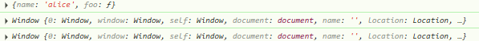
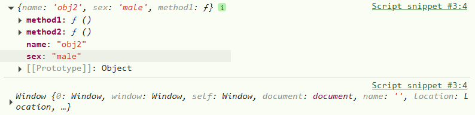
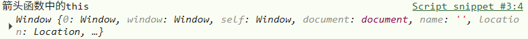
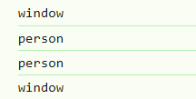

# JS

## this 关键字

### this 四种绑定方式

#### 一、默认绑定

#### 二、隐式绑定

#### 三、显示绑定

#### 四、new 绑定

### this 绑定的优先级

#### 一、隐式绑定高于默认绑定

#### 二、显示绑定高于隐式绑定

#### 三、new 高于隐式绑定

###### 四、new 高于显示绑定

#### 总结：

以上四种绑定的优先级顺序为：

> new 关键字 > 显示绑定 > 隐式绑定 > 默认绑定

### 规则之外

还有几种特殊的绑定方式，不在上述四种绑定规则中。

#### 一、忽略显示绑定

> 当显示绑定的值为 `null` 或 `undefined` 时，`this` 直接绑定 `window` 。

```js
var user = {
    name: 'alice',
    foo: function () {
        console.log(this);
    }
}
user.foo();
user.foo.call(null);
user.foo.apply(undefined);
```

以上代码执行结果如下： 

#### 二、间接函数引用

```javascript
var obj1 = {
    name: 'obj1',
    foo: function () {
        console.log(this);
    }
}

var obj2 = {
    name: 'obj2',
    sex: 'male',
};

obj2.method1 = obj1.foo;
obj2.method1();

(obj2.method2 = obj1.foo)();

```

以上代码执行结果为：



两种方式所绑定的 `this` 不同，第二种方式进行了赋值调用，实际上是间接函数引用。

 `(obj2.method2 = obj1.foo)` 这里返回了赋值的结果，再加上一个小括号，就直接调用赋值的结果函数。

#### 三、箭头函数

> 箭头函数是不绑定 `this` 的，它的 `this` 来源于上级作用域。

```javascript
var user = {
    name: 'kiki',
    foo: () => {
        console.log("箭头函数中的this", this);
    }
}

user.foo();
```



这里调用 `foo` 函数，因为箭头函数不绑定 `this` ，所以去 `foo` 函数的上级查找 `this` ，找到了全局对象 `window` 。

### 面试题

#### 1、考察间接函数引用

```javascript
var name = "window";
var person = {
    name: "person",
    sayName: function () {
        console.log(this.name);
    } 
};

function sayName() {
    var sss = person.sayName;
    sss();
    person.sayName();
    (person.sayName)();
    (b = person.sayName)();
}

sayName();

```



执行 `sayName` 函数：

- 变量 `sss` 被 `person.sayName` 方法赋值，执行 `sss` 函数，此时是独立函数调用，`this` 指向全局

`window` ，全局中变量 `name` 被绑定到了 `window` 中，所以 `this.name` 为 `"window"` 。

- `person.sayName()` 为隐式绑定，`this` 指向 `person` 对象，所以 `this.name` 为 `person.name` ，即 `"person"` 。
- `(person.sayName)()` 与前一个本质是一样的，隐式绑定，`this` 指向 `person` 对象，所以 `this.name` 为 `person.name` ，即 `"person"` 。
- `(b = person.sayName)()` 是间接函数引用，`person.sayName` 赋值给 `b` 变量，而小括号括起来的代表赋值的结果，`this` 指向 `window` ，`this.name` 为 `window.name` ，即 `"window"` 。


#### 2、定义对象时是不产生作用域的

#### 3、构造函数中定义函数，该函数的上级作用域是构造函数

#### 4、区分作用域
