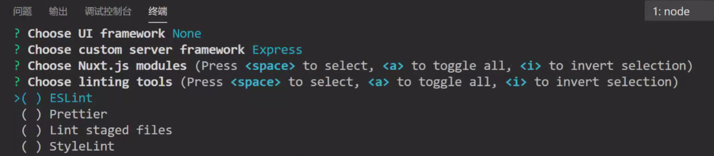
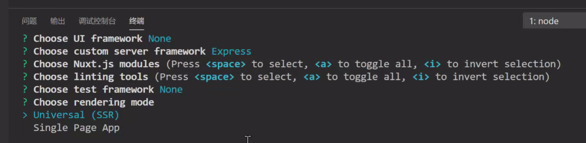

# Nuxt 项目使用 ElementPlus

## 一、安装 Element Plus

```bash
npm install element-plus
```

## 二、全局引用 Element Plus

在 Nuxt 中推荐使用插件方式引入 Element Plus。

### 1. 创建插件文件（`plugins/element-plus.ts`）

Nuxt 3 + TypeScript 项目：

```typescript
// plugins/element-plus.ts
import { defineNuxtPlugin } from '#app'
import ElementPlut from 'element-plus'
import 'element-plus/dist/index.css'

export default defineNuxtPlugin((nuxtApp) => {
    nuxtApp.vueApp.use(ElementPlus)
})
```

如果用的是 `.js` 项目就用 `.js` 文件写法。

### 2. 注册插件（如果没有自动注册）

在 `nuxt.config.ts` 里确认已包含 plugins 配置 (Nuxt 通常会自动扫描 `plugins/` 目录，但可以手动加上)：

```typescript
export default defineNuxtConfit({
    plugins:['~/plugins/element-plus'],
})
```

## 三、使用组件

```vue
<template>
  <el-button type="primary">按钮</el-button>
<template>
```

## 四、确保没有 SSR 问题

如果某些组件在 SSR 下不兼容，可以延迟加载或在客户端加载：

```vue
<script setup>
  import { ElMessage } from 'element-plus'
  
  onMounted(() => {
    ElMessage.success('页面加载成功')
  })
})
</script>
```

# 服务端 vs 客户端

## 什么是 CSR

## 什么是 SSR

seo优化好，要求服务器要求高

## CSR 和 SSR 优缺点对比

单页面（SPA）的SEO极其不友好

# Vue.js 服务端渲染

初始化项目环境

> npm init -y

安装vue 和 vue 的服务端的渲染包

> npm i vue vue-server-render

# Nuxt 框架安装_开发_打包_环境介绍

> vue init nuxt-community/starter-template ./my-nuxt
>
> npx create-nuxt-app ./my-nuxt

代码校验的工具：



选择后端渲染：



# 04.2 nuxtServerInit_middleware_validate

middleware:

    中间件执行流程顺序：

    nuxt.config.js -> 匹配布局 -> 匹配页面

validate必须定义在页面组件

# Nuxt 生命周期

CSR:

在客户端中，使用window获取BOM，使用 this 获取组件。

在服务端，使用 context 获取上下文。

# Vue 的生命周期

`beforeCreate` 和 `created` 都会跑在客户端和服务端

使用调试器修改数据，如果数据在页面没有被渲染，则不会触发update。

在代码里面修改数据，即使数据没有在页面进行渲染，也会触发update。

# 04.3 asyncData_fetch_render_客户端钩子_window_this指向

# 04.4 基础小结

# 05.1 约定式路由

约定式

    展示区：`<nuxt/>`

    声明式跳转：`<nuxt-link :to="{name:'product-id', params:{id:3},query:{a:111,b:222}}">商品03</nuxt-link>`

    name: 路由名  目录名-其他目录-文件名

    params: key 要对等文件名

  子路由：

    目录代表子路由，子路由内部同级的文件，代表的是同一级路由

    展示区层级控制

# 05.2 展示区层级


# 05.3 扩展路由


# 05.4 参数校验_错误路由定制_统一动效和独享动效

使用服务端的钩子：

validate() {}

# 05.5 路由守卫

前置  依赖中间件 `middleware` 插件

    全局守卫： nuxt.config 指向 middleware
              layouts定义中间件
    组件独享守卫：
              middlewware
    插件全局前置守卫
              在plugin目录下创建 `router.js`
后置：
    使用 `vue` 的 `beforeRouteLeave` 钩子
    插件全局后置守卫

# 06.1 数据交互，跨域
  安装：
    @nuxtjs/axios、@nuxtjs/proxy

# 06.2 拦截器配置与token携带

# 06.3 loading页配置与定制

自定义loading界面
nuxt是数据预载的，数据载完后才会跳到对应的界面

# Vuex定义与使用
  **模块方式：** `store` 目录下的每个 `.js` 文件会被转换成为状态树[指定命名的子模块]
  (http://vuex.vuejs.org/en/modules.html) (当然，`index` 是根模块)

  Classic(不建议使用)：`store/index.js` 返回创建Vuex.Store实例的方法

# 07.1 vuex定义与使用
这一章没怎么听懂，到时候再听一遍吧


# nuxt3 的组件标签的命名方式不再推荐使用短横线连接（kebab-case），而是推荐使用 PascalCase (大驼峰命名法)。
在 **Nuxt 3** 中，默认情况下，**组件标签的命名方式**发生了变化，不再推荐使用短横线连接（kebab-case），而是推荐使用 **PascalCase（大驼峰命名法）**。  

### 1. **组件命名规则**
- **推荐写法（PascalCase）**：  
  ```vue
  <MyComponent />  <!-- 推荐 -->
  ```
- **传统写法（kebab-case）**（可能不推荐或需要额外配置）：  
  ```vue
  <my-component />  <!-- 在某些情况下可能不自动识别 -->
  ```

### 2. **为什么 Nuxt 3 更推荐 PascalCase？**
- **Vue 3 的默认规范**：Vue 3 官方推荐使用 **PascalCase** 来保持一致性，特别是在 `<script setup>` 中。  
- **更好的 IDE 支持**：VS Code + Volar 对 PascalCase 的组件名提供更好的自动补全和跳转支持。  
- **与 JS/TS 模块导入风格一致**：因为组件通常是通过 `import MyComponent from '~/components/MyComponent.vue'` 导入的，PascalCase 更符合 JS/TS 的命名习惯。  

### 3. **如何让 kebab-case 仍然可用？**
如果你仍然希望支持 `my-component` 这种写法，可以：
#### **方法 1：手动注册组件（显式导入）**
```vue
<script setup>
import MyComponent from '~/components/MyComponent.vue'
</script>

<template>
  <MyComponent />  <!-- PascalCase -->
  <my-component />  <!-- kebab-case（仍然可用，但不推荐） -->
</template>
```
#### **方法 2：修改 `nuxt.config.ts` 配置**
在 `nuxt.config.ts` 中，可以调整 `components` 的命名规则：
```ts
export default defineNuxtConfig({
  components: {
    // 允许 kebab-case 自动导入
    dirs: [
      '~/components',
      {
        path: '~/components',
        pathPrefix: false, // 禁用路径前缀（防止自动转换短横线）
      },
    ],
  },
})
```
但这种方式可能会导致一些 IDE 支持变差，**官方仍然推荐 PascalCase**。

### 4. **总结**
| 写法 | 推荐程度 | 说明 |
|------|---------|------|
| `<MyComponent />` | ✅ 推荐 | Nuxt 3 默认推荐，Vue 3 风格 |
| `<my-component />` | ⚠️ 可用但不推荐 | 可能需要额外配置 |

建议尽量适应 **PascalCase**，因为它是 Vue 3 和 Nuxt 3 的推荐写法，未来生态工具（如 Volar、unplugin-vue-components）也会优先支持这种风格。


# 使用 `npx` 和 `nuxi` 创建 `nuxt` 项目
`npx nuxi init my-nuxt-app` 是 **Nuxt 3** 官方提供的初始化项目的命令，用于快速创建一个新的 Nuxt 3 应用程序。下面我会详细讲解这个命令的各个部分以及它的作用。  

---

## **1. 命令解析**
```bash
npx nuxi init my-nuxt-app
```
| 部分 | 说明 |
|------|------|
| `npx` | Node.js 自带的包执行工具，用于临时下载并运行 npm 包（无需全局安装）。 |
| `nuxi` | Nuxt 3 提供的命令行工具（Nuxt CLI），用于创建和管理 Nuxt 项目。 |
| `init` | `nuxi` 的子命令，表示初始化一个新项目。 |
| `my-nuxt-app` | 项目文件夹名称（可自定义）。 |

---

## **2. 执行过程**
运行该命令后，会执行以下步骤：
1. **检查环境**：确保 Node.js（>= 16.11.0）和 npm/yarn/pnpm 已安装。
2. **下载 `nuxi`**：临时使用 `npx` 运行 `nuxi`，无需全局安装。
3. **创建项目**：
   - 生成 `my-nuxt-app` 文件夹。
   - 自动安装 Nuxt 3 基础依赖（`nuxt`、`vue` 等）。
   - 生成默认项目结构（`nuxt.config.ts`、`app.vue` 等）。
4. **完成初始化**：提示项目创建成功，并给出后续操作指引。

---

## **3. 生成的项目结构**
执行完成后，`my-nuxt-app` 目录结构大致如下：
```
my-nuxt-app/
├── .nuxt/          # Nuxt 自动生成的临时文件（开发/构建时使用）
├── node_modules/   # 依赖包
├── app.vue         # 应用入口组件（相当于传统 Vue 的 main.js）
├── nuxt.config.ts  # Nuxt 配置文件（TypeScript 格式）
├── package.json    # 项目依赖和脚本
└── README.md       # 项目说明文档
```

---

## **4. 后续操作**
初始化完成后，可以进入项目目录并启动开发服务器：
```bash
cd my-nuxt-app
npm install   # 如果依赖未自动安装，手动安装
npm run dev   # 启动开发服务器
```
然后访问 `http://localhost:3000` 即可看到默认的 Nuxt 3 页面。

---

## **5. 可选参数**
`nuxi init` 支持一些额外的选项：
| 参数 | 说明 | 示例 |
|------|------|------|
| `--verbose` | 显示详细日志 | `npx nuxi init my-app --verbose` |
| `--force` | 强制覆盖已有目录 | `npx nuxi init my-app --force` |
| `--git-init` | 初始化 Git 仓库 | `npx nuxi init my-app --git-init` |
| `--install` | 自动安装依赖 | `npx nuxi init my-app --install` |

例如：
```bash
npx nuxi init my-nuxt-app --force --git-init
```

---

## **6. 与 `create-nuxt-app` 的区别**
在 **Nuxt 2** 时代，官方推荐使用 `create-nuxt-app` 初始化项目：
```bash
npx create-nuxt-app my-old-nuxt-app
```
但在 **Nuxt 3** 中，官方改用 `nuxi init`，因为它：
- 更轻量（不依赖 `create-nuxt-app`）。
- 更符合现代前端工具链（如 Vite、ESM）。
- 支持 TypeScript 开箱即用。

---

## **7. 常见问题**
### **Q1: 需要全局安装 `nuxi` 吗？**
❌ **不需要**，`npx` 会自动下载并运行最新版本的 `nuxi`。  

### **Q2: 能否用 `yarn` 或 `pnpm`？**
✅ **可以**，初始化后可以手动运行：
```bash
yarn install
yarn dev
```
或
```bash
pnpm install
pnpm dev
```

### **Q3: 初始化失败怎么办？**
- 检查 Node.js 版本（`node -v`，需 >= 16.11.0）。
- 清除 npm 缓存：
  ```bash
  npm cache clean -f
  ```
- 尝试使用 `--verbose` 查看详细错误：
  ```bash
  npx nuxi init my-app --verbose
  ```

---

## **8. 总结**
| 命令 | 作用 | 适用版本 |
|------|------|---------|
| `npx nuxi init my-nuxt-app` | 快速创建 Nuxt 3 项目 | Nuxt 3 |
| `npx create-nuxt-app my-old-app` | 创建 Nuxt 2 项目（旧版） | Nuxt 2 |

**推荐使用 `npx nuxi init` 创建 Nuxt 3 项目**，它更现代、更高效，并且默认支持 TypeScript 和 Vite。 🚀