# 当前进度：

该看 6.6 了

# 1.1 微信小程序开发项目介绍及知识点概述

# 1.2 安装微信开发者工具及界面介绍

# 1.3 小程序项目目录介绍重点知识概述

一般用 iphonex 机型来进行测试

index.wxml 代表首页

utils 工具类的存放目录

.eslintrc.js 代码格式化  定义各种规则  比如禁用 console.log()

app.json 整个项目的配置

sitemap.json 类似于爬虫，开启后，页面中的东西都可以被检索到

# 2.1 视图容器 view 组件及属性和快捷布局技巧

.container

总结一下事件冒泡的相关问题

不要使用div

# 2.2 基础内容组件 text, icon, progress 组件属性

&lt   使用text的 `decode` 属性

# 2.3 响应式自适应单位 rpx 和 px 的差异

750 x 1334

逻辑分辨率与物理分辨率

1px = 2rpx

把屏幕想象成宽度为750，单位都用 rpx

# 2.4 scroll-view 可滚动视图区域组件

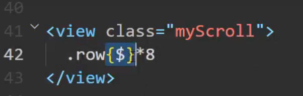

# 2.5 movable-area 自由移动及 match-media 响应

# 2.6 root-portal 子树从页面中脱离出来

遮罩一般使用 position:fixed

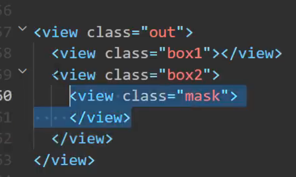

如果父级元素的z-index没有同级元素的高，那么该父级元素的子元素的同级再高，也不会遮盖住该父级元素的同级元素。

如果不想破坏布局结构，可以使用 `root-portal` 来包裹该遮罩，然后把该遮罩的样式放到全局 `app.wxss` 中。

# 2.7 微信小程序 app.json 全局及页面配置

# 2.8 媒体组件 image 的 src 三种引入方式

在根目录下新建一个static文件夹里面存放静态资源（图片、音频、视频）

# 2.9 mode 图片裁剪模式及其他属性

建议用缩放模式。

lazy-load属性 图片懒加载

# 2.10 video 视频组件及 uniCloud 云存储网络地址的用法

poster属性设置封面

# 2.11 navigator 页面链接导航

下面的导航菜单页面叫做 TabBar 页面

# 3.1 app.js 中的生命周期函数与 globalData

拿到全局对象

const app = getApp()

console.log(app.globalData)

# 3.2 page 内的 onload 及 data 差值表达式

在onLoad里面：

this.setData({

    name:"李四"

})

# 3.3 data 中不同数据类型渲染及 if 条件渲染

# 3.4 for 循环列表渲染的用法

# 3.5 bindtap 小程序中的事件触发

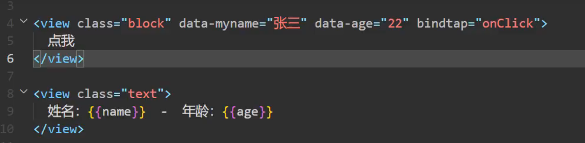

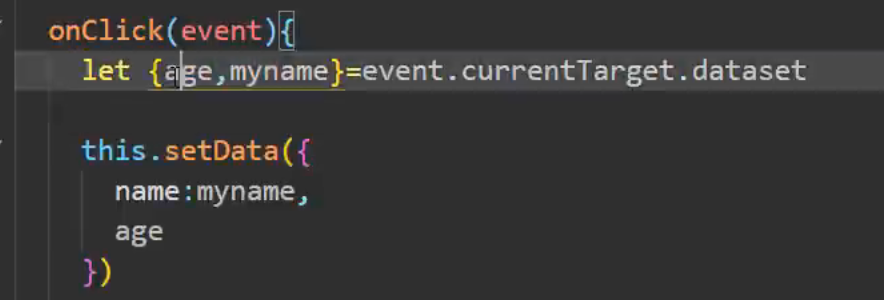

# 3.6 【小案例】熟练使用事件与数据绑定取随机值

标准让文字处于中心的位置：弹性盒模型

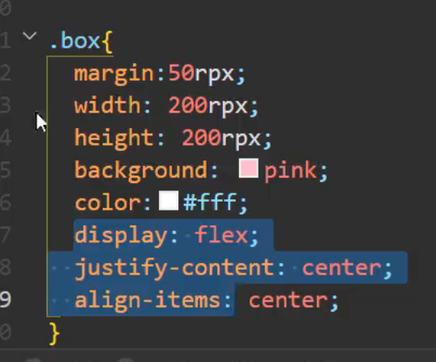

# 3.7 表单组件 button 和 input

loading注意：

loading="{{false}}"

# 3.8 input 不同的事件类型及用法

# 3.9 checkbox 多选按钮及 label 组件

`<textarea>` 可输入多行，`<input>` 只能输入一行

减号两边必须有空格

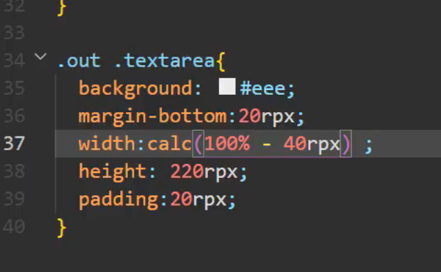

或者：

变成内填充

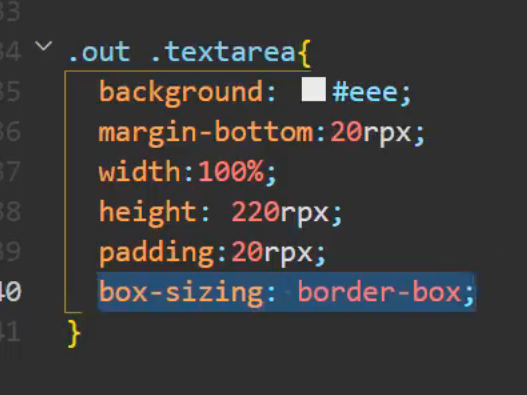

# 3.10 【小案例】表单提交样式布局与 model 双向绑定

# 3.11 【小案例】完成 form 评论案例的实现逻辑

总结一下数组的splice用法

`<block>` 完全用来做布局的标签，做if判断，最终渲染出来的html不会包含 `<block>`标签

# 4.1 小程序官方 api 文档 showToast 提示框

# 4.2 showModal 和 showLoading 界面交互的操作

# 4.3 在案例中使用 api 中的交互

封装成函数可以避免一些回调地狱

《ES6 Promise的用法，ES7 async / await 的用法》

# 4.4 常见的导航栏 api 接口

# 4.5 全局与页面配置中关于 window 窗口 UI 设置

可以设置"entryPagePath":"pages/api/api" 来设置启动页。

页面配置会比全局配置的优先级更高。

"navigationStyle":"custom"：通屏配置

# 4.6 tabBar 底部 tab 栏的配置用法

# 4.7 api 中 navigate 路由接口与组件的关系

可以传参

# 4.8 【小案例】初识 wx.request 获取网络请求并渲染至页面

学习一下 api post的使用

# 4.9 【小案例】开启下拉刷新页面 enablePullDownRefresh

无论请求成功与否，都关闭：

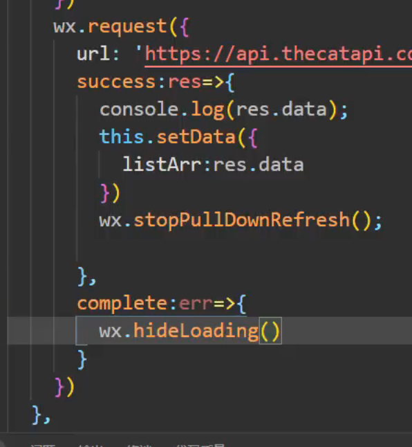

# 4.10 【小案例】触底加载更多数据 onReachBottom

# 4.11 wx.request 的其他参数

# 4.12 【小案例】网络请求及表单采集综合练习

# 4.13 【小案例】页面交互增加友好体验

# 4.14 自定义组件 Component 的用法

# 4.15 自定义组件传递属性 properties

小程序最多只能同时保留 **10 个页面**在页面栈中，超出后 `navigateTo` 会失效。

你可以用 `getCurrentPages()` 查看当前栈深：

如果 `pages/demo/demo` 是在 tabBar 中配置的页面：

那就不能用 `wx.navigateTo()` 跳转，而是要用 `wx.switchTab()`：

# 5.1 注册小程序账号获取 appid 及个人和企业版差异

# 5.2 在微信小程序如何使用 scss 编译 wxss 文件

# 5.3 页面初始化配置全局样式

# 5.4 定义公共的头部组件 component 引入的各个页面

把组件可以注册到全局配置界面： `app.json` 中

# 5.5 页面 banner 使用 swiper 的更多属性

# 5.6 scroll-view 滑动组件在项目中的使用

# 5.7 页面中引入背景图片的两种方式

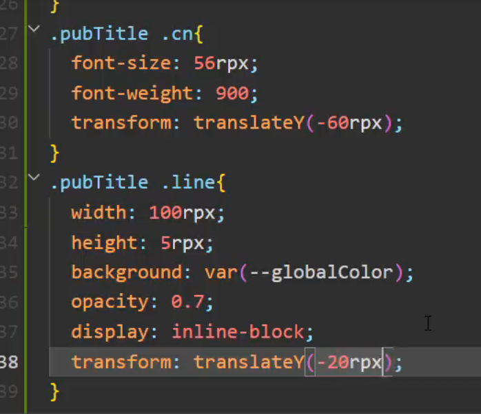

使用 transform 不会脱离文档流

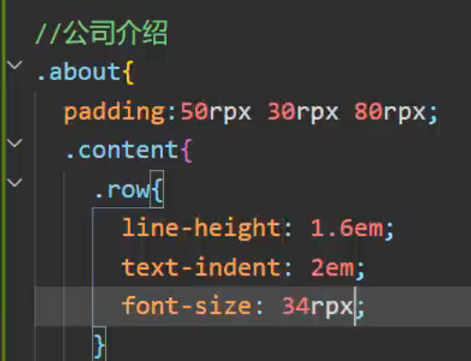

学习一下 em

在CSS中使用url时：1、可以把图片转换为 base64   2、使用网络的图片地址

# 5.8 flex 弹性布局的更多用法布局新闻组件

语法：

.block*3

字体两端对齐：

text-align:justify

CSS 中两行省略号

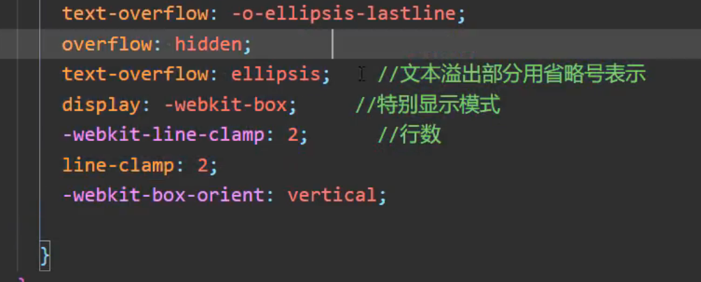

# 5.9 第三方 UI 组件库 vant weapp 和 TDesign

小图标不建议使用图片，比较占空间，一般使用字体图标，iconfont

研究一下字体图标  van-icon 是怎么实现的

# 5.10 vant 中的字体图标在项目中的使用

# 5.11 自定义底部组件获取 data 动态数据方法

# 5.12 使用原生内置编译插件直接支持 sass 文件

# 5.13 animation 动画制作客服浮窗

border-radius:50%

可以变成一个圆形

透明效果：

opacity:0

# 6.1 请求项目接口渲染首页数据

# 6.2 自定义组件进阶 - 父组件向子组件传值

可以直接向子组件传一个对象：

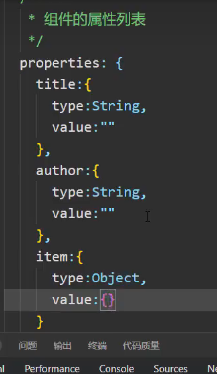

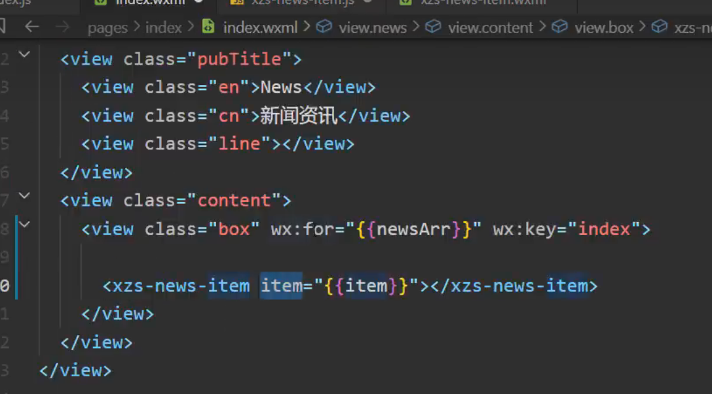

# 6.3 将数据通过自定义方法进行格式化

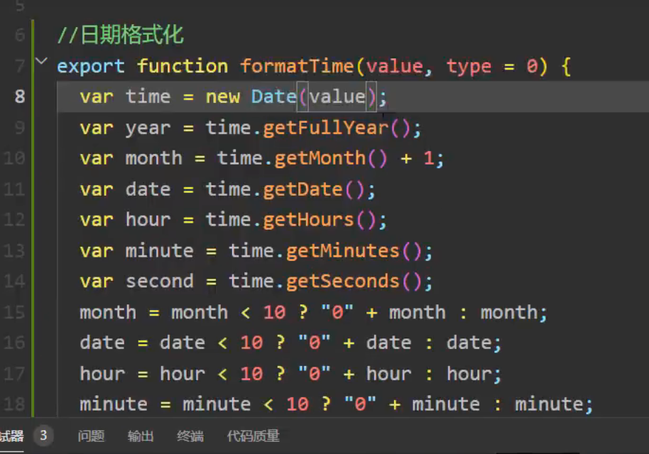

# 6.4 promise 封装 request 请求的用法

`防抖` `节流` 

# 6.5 封装的接口在项目中调用

# 6.6 新闻列表页面布局及数据渲染

# 6.7 触底加载更多引入 vant 的 loading 样式

# 6.8 无更多数据结束网络请求进行节流

# 6.9 布局新闻详情获取详情页数据

# 6.10 rich-text 渲染富文本使用正则修改富文本样式

# 6.11 新闻列表传参跳转不同的详情页

# 6.12 小程序分享及转发朋友圈 onShareAppMessage

# 7.1 产品分类页面引用 vant-tabs 标签页

# 7.2 封装产品组件获取 api 接口数据

# 7.3 根据点击事件获取导航索引加载相关数据

# 7.4 实现各个分类下的触底加载更多

# 7.5 实现首页导航跳转到指定的产品分类页

# 7.6 产品详情页布局及 makePhoneCall 拨打电话

# 8.0 【完结撒花】项目打包上线及课程总结
